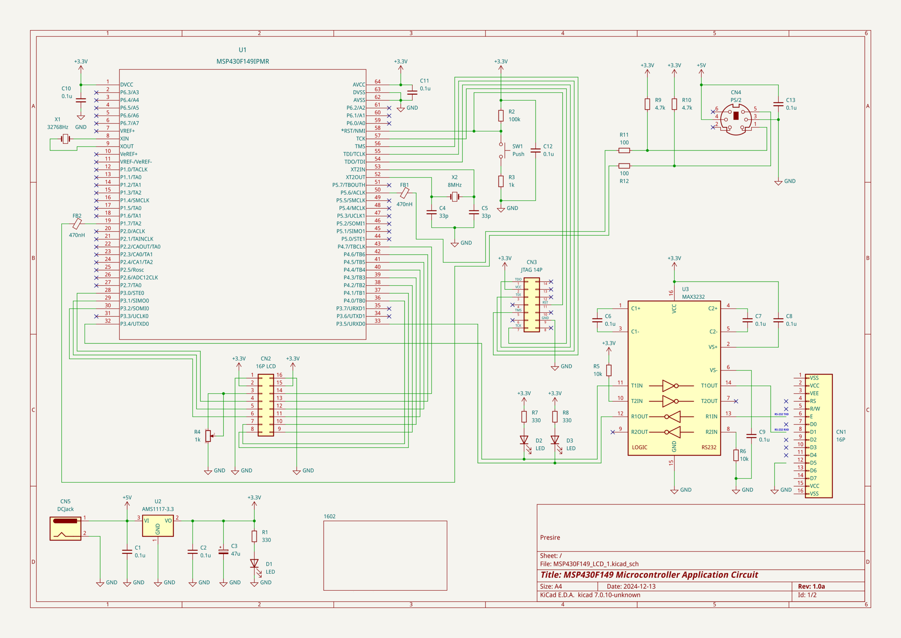
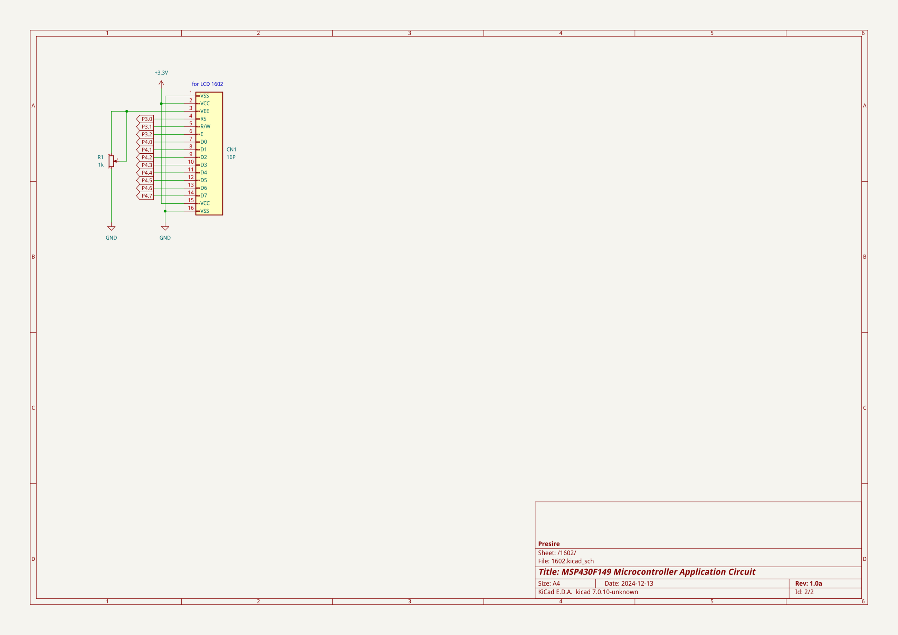

# Preface

This circuit uses the MSP430F149 microcontroller to control LCD (1602) and PS/2 devices (keyboard, etc.).  
Circuit and firmware are included.  
 

In this circuit, pressing a key on a particular PS/2 keyboard causes a buzzer to sound for a specified time.  
 

The PS/2 keyboard uses the PORT1 interrupt handler to decode and read the key.  
 

This firmware can also be customized to play a melody from the buzzer.  
For example, using Timer_A, etc.  
 

The MSP430F149 microcontroller, LCD (1602), and PS/2 connector are connected as shown below.  
 

|
MSP430F149 Schematic
|
MSP430F149 Schematic 1602
|
|---|---|
|||
 

